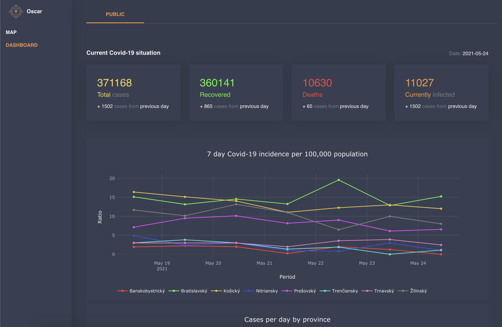
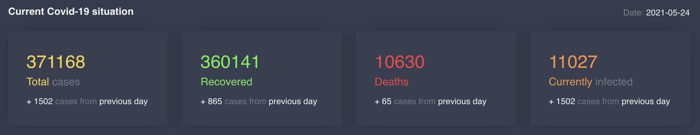
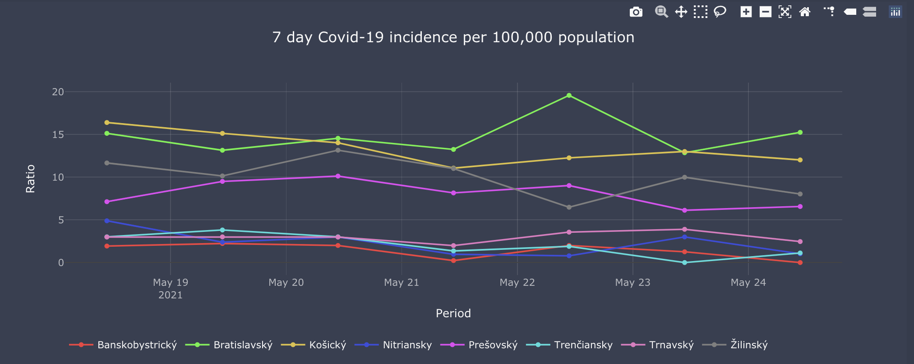
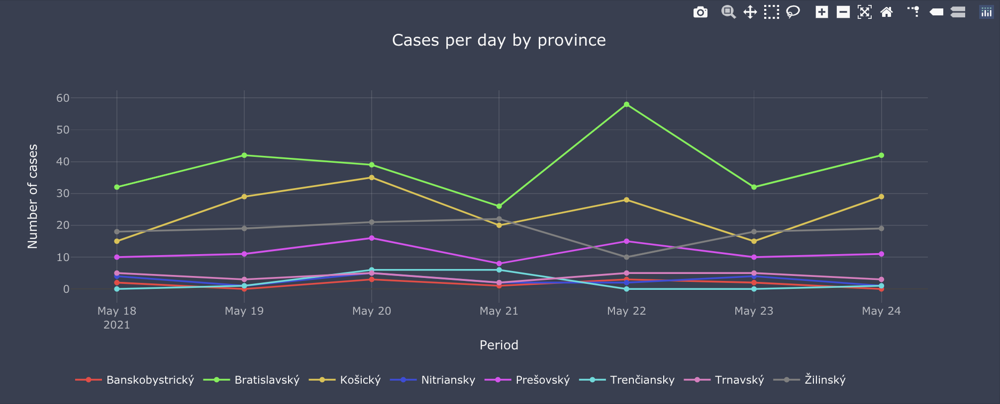
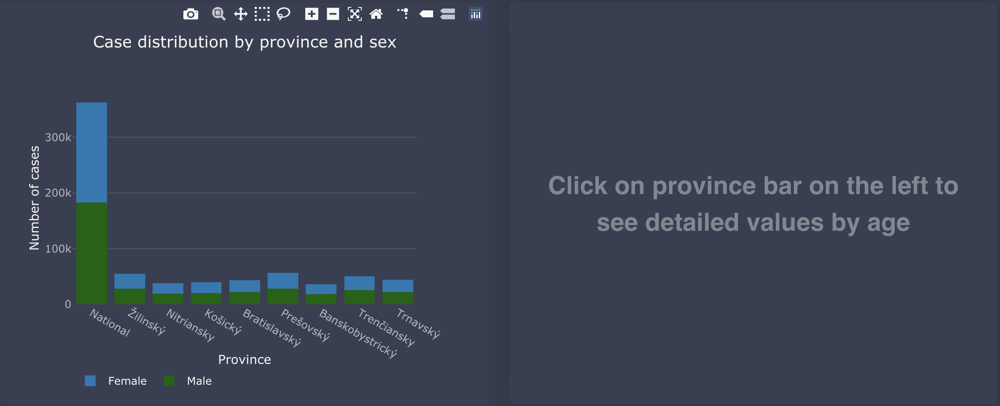
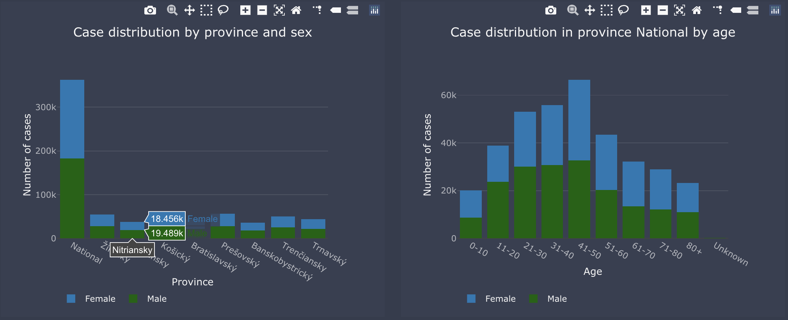

# Dashboard tabs

As an alternative visualisation to map, we provide dashboard with graphs grouped in multiple Tabs (in first version, only one tab is provided). In this section we will walk through the Tabs and graphs in them.     
As we focus on current Covid-19 pandemic, currently developed tabs are focused on data about this pandemic.
     
## Public Tab     
First tab provides global overview on the current Covid-19 situation in four graphs.      

### Current situation
First graph on the tab shows most important numbers:
    
These values are fetched from api under following attributeId names in [config in api](../data-structures/config-files.md#dashboard-tabs-config):     
```
NEW_CASES_TOTAL: attributeId for total cases for country from yesterday
DEATHS_TOTAL: attributeId for total deaths for country from yesterday
INFECTED_TOTAL: attributeId for total infected for country from yesterday
RECOVERED_TOTAL: attributeId for total recovered for country from yesterday
DEATH_YESTERDAY_INCREASE: attributeId for new deaths for country from yesterday
RECOVERED_YESTERDAY_INCREASE: attributeId for newly recovered for country from yesterday
NEW_CASE_YESTERDAY_INCREASE: attributeId for new cases for country from yesterday
```
### 7 day Covid-19 incidence per 100,000 population
     
These values are fetched from api under following attributeId names in [config in api](../data-structures/config-files.md#dashboard-tabs-config):     
```
SEVEN_DAYS_COINCIDENCE: attributeId for 7 days incidence rate on covid-19 cases on admin1 administrative geographical level 
```
### Cases per day by province
New daily cases for last week in provinces.       
      
These values are fetched from api under following attributeId names in [config in api](../data-structures/config-files.md#dashboard-tabs-config):  
```
CASES_BY_DAY_PROVINCES: attributeId for new covid-19 cases on admin1 administrative geographical level 
```     
### Case distribution by province and sex
Graph with detailed distribution of cases.      
    
            

        
This values are fetched from api under following attributeId names in [config in api](../data-structures/config-files.md#dashboard-tabs-config):      
```
TOTAL_CASES_PER_ADMIN0: first common part of attributeIds on admin0 level
TOTAL_CASES_PER_ADMIN1: first common part of attributeIds on admin1 level
```
