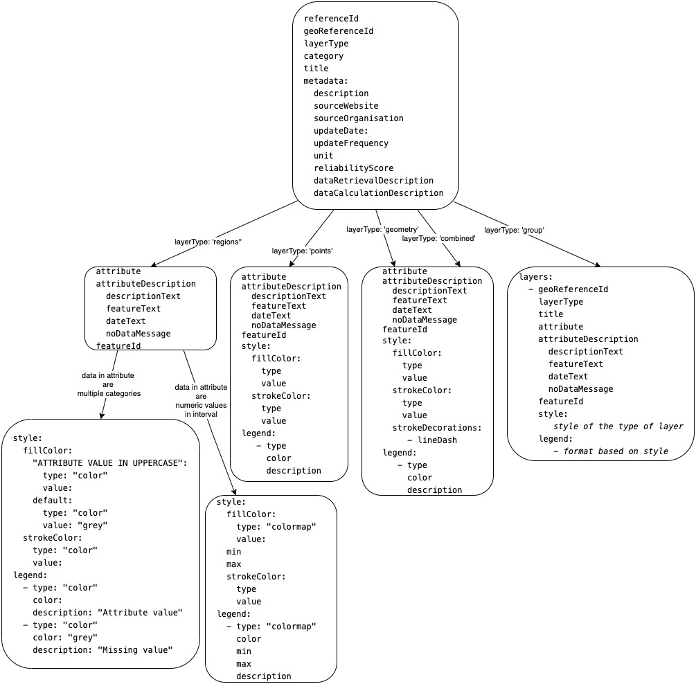

# Configuration files

Detailed explanations of structure of configuration files.

## Dashboard tabs config

```
map:
  x: number
  y: number
  zoom: number
```

Map coordinates in [x,y] format and zoom level.

```
tabs:
  - index: 0
    label: "Public"
    urlIdentifier: "public"
```

The dashboard part of config is defined as array of tabs. First, we set the index, which is used as index of the tab and defines the order, too. Following are tab label and 'urlIdentifier', which will be used in the url.

```
    filters:
      - name: featureId
        type: autocomplete
        title: "Admin1"
        itemsSource: "/api/attributes/Daily Covid19 Cases Per Admin1/uniqueFeatures"
```

Each tab can have multiple filters from [predefined set](../../frontend/src/components/filters/DashboardFilter.js).

```
    graphs:
      - category: "covid19Graphs"
        graphName: "SevenDaysIncidenceRate"
        id: "SevenDaysIncidenceRate"
        key: "currentPSevenDaysIncidenceRaterotectedAreasSituation"
        attributeId: "7 Days Incidence Rate Per Admin1"
```

Graphs can be also selected from options in [OscarGraph.js](../../frontend/src/components/graphs/OscarGraph.js) with options required by specified component.

```
    printGraphs:
      - htmlId: "CurrentCovid19Situation"
        type: "htmlViaCanvas"
      - htmlId: "SevenDaysIncidenceRate"
        type: "plotlyGraph"
      - htmlId: "CasesPerDayByProvince"
        type: "plotlyGraph"
      - htmlId: "totalCasesAdmin0Graph"
        type: "plotlyGraph"
        size: 0.5
      - htmlId: "totalCasesAdmin1Graph"
        type: "plotlyGraph"
        size: 0.5
```

Last defined are print settings for graphs which should be exported in pdf generated from tab. 'htmlId' refers to 'id' on item in graphs array. Type depends on how the graph component is composed. Size parameter defines width of the graph on generated document (A4 format). Last two graphs in this example will be side by side.

## geoData.yml

File is basically one long array with items for each geodata file that should be stored.
Structure of one item:  
_with geodata file provided by url to publicly available source_

```
- name: descriptive name for human reference
  referenceId: unique id for the geodata, the file will be referred by this value
  geoDataUrl: full publicly available url
  format: file format
  featureIds: array with all Features properties names and fullnames of geographical areas & all existing values
  attributeIds: list of all available Features properties
  geometryDataTypes: types of geographical data
  metadata: information about the geographical data in file
    description: String
    sourceWebsite: String
    sourceOrganization: String
    updateDate: String
    updateFrequency: String
    unit: String
    reliabilityScore: String
    dataRetrievalDescription: String
    dataCalculationDescription: String
```

_or with geodata file provided in folder './initial-data-load/data/{COUNTRY}/geoData/'_

```
- name: descriptive name for human reference
  referenceId: unique id for the geodata, the file will be referred by this value
  geoDataFilename: name of the file in above mentioned folder
  format: file format
  featureIds: array with all Features properties names and fullnames of geographical areas & all existing values
  attributeIds: list of all available Features properties
  geometryDataTypes: types of geographical data
  metadata: information about the geographical data in file
    description: String
    sourceWebsite: String
    sourceOrganization: String
    updateDate: String
    updateFrequency: String
    unit: String
    reliabilityScore: String
    dataRetrievalDescription: String
    dataCalculationDescription: String
```

\_in addition geodata can be stored in newly created database collection by adding the following into an item structure

```
  storeToDb: true
  collectionName: "nameOfNewCollection"
  apiUrl: "urlInApiThatReturnsStoredGeodata"
```

## mapLayers.yml

This config file is one long array with settings for layers in map. As there are multiple types of layers (regions, points on map, any geometrical objects or even combination of them and tile layers) and also multiple sources of data for one layer, the structure of items in array may vary greatly.



### Attributes explained

**referenceId**: unique id for the layer, the layer will be referred by this value,  
**geoReferenceId**: unique 'referenceId' of geodata file from geoData.yml,
**category**: each layer can be organised into category based on data. In current version, validation allows only one of following: 'Baseline data', 'Health facilities' or 'Covid-19'.
**title**: name of the layer in layers menu in UI
**layerType**: the application accepts multiple types of geographical data. Either the country is divided in areas ('regions') or there are only coordinates for places ('points'). It can also have just specific geometrical objects in 'geometry' layers or even combination of points and geometry in 'combined' layer. In case there are multiple sources, the overall layer is 'group' and it has 'layers' array with multiple layers of the other types.  
**attribute**: either name of property in Feature in geojson or attributeId in attributes collection with data for this layer,  
**attributeDescription:**

- **descriptionText**: description of the value, will be displayed in 'What is here' popup,
- **featureText**: description with additional information, e.g. administrative level,
- **noDataMessage**: this message will be there, if value is missing,
- **dateText**: description of date, if it should be displayed,

**featureId**: property in Feature in geojson file under which the value for 'featureId' in attributes is stored,

**tileDataUrl**: url of map tile layer data source,

**tileAttributions**: attributions of the tile layer data source,

**metadata**: informations about data in layer, they are shown when you click on info button aside from map layer in layers menu

- **description**:,
- **sourceWebsite**:,
- **sourceOrganisation**:,
- **updateDate**:,
- **updateFrequency**:,
- **unit**:,
- **reliabilityScore**:,
- **dataRetrievalDescription**:,
- **dataCalculationDescription**:,

**layerOptions**: different options that can be set on layers and change their behavior on the map

- **singleDisplay**: true or false, whether the region layer must be displayed alone or could be displayed with another layers
- **maxResolution**: number, maximum resolution on which layer is shown
- **timeseries**: true or false, whether there are values from multiple dates in database and they should be displayed on frontend in timeline. If this value is false, the latest data are fetched,

#### Style object

Style and legend values are specific for each type or geographical data as well as attributes values type. In this section they will be explained for each of the bottom boxes in the graph above.

##### Basic building block

For style, on the lowest level, the color object is defined in following structure:

```
type: 'color'/'colormap/intervals'
value:
```

The application accepts types: 'color', which is basically string with color in any css accepted format (usually color name or rgba value) and 'colormap' which has fixed list of available maps: ['blue', 'green', 'red', 'hot'].

ìntervals`: Also new type is introduced for data which can be ordered and compared. The 'value' is array of objects with three necessary values:
```
min: min value, this value IS NOT included
max: max value, this value IS included
color: string with color in any css accepted format (usually color name or rgba value)
```
If min value is omitted, all values less than max value are considered in this interval. Likewise, if max value is omitted, all values more than min value are considered in this interval.

##### regions layer with attribute data in categories

In case the geographical layout of data is in regions (country is divided into areas and there is value for each area) and there is fixed set of available values for used attribute, the style is set with color for each value. 'fillColor' attribute has the values as keys. Each of them has standard color structure.  
For the borders of regions, one 'strokeColor' in style object can be defined in the basic color structure.

##### regions layer with attribute with numeric values in interval

Regions can also have values from numeric interval. In that case style object needs 'min' and 'max' values and the color is picked from colormap scaled by this min and max.

##### points layer

This layer displays geojson Features with only one pair of longitude latitude coordinates as filled circle. Inside of the circle is in 'fillColor' and the outline in 'strokeColor'.

##### geometry layer

For custom geometrical object, like open polylines or polygons. Style in this layer allows to specify two color values similarly as in graphic applications, one for strokes created by arrays of points in geojson Features and second for filling closed objects/triangles created by this points.  
Only in this layer, new array with decoration on the stroke is available. In first version, only one embellishment is available.

```
strokeDecorations:
  - lineDash
```

As the name of it prompts, with this enabled, the stroke line is dashed.

##### combined layer

Not always are data nicely structured in only one way. For this cases, combined layers style is able to show points and geometrical shapes in one layer.

##### tile layer

Tile layer provides an option to display data provided by external data source through url in form of map tiles.

#### Legend object

Legend values are closely intertwined with style. Basically for each color or colormap used in visualisation, there should be one item in legend array.  
For values with type 'color', the legend item has these three keys:

```
'type': 'color'
'color': color value, the same as in color object in style
'description': text which should be displayed in legend
```

For values with type 'colormap', the legend has two more keys, copied from style:

```
'type': 'color'
'color': color value, same as in color object in style
'min': same as in style
'max': same as in style
'description': text which should be displayed in legend
```

## attributes

This folder is place to store files with data in .csv format. For the data to load correctly into database and connect with geographical data, following restrictions must be met:

- delimiter in this file is ';' or ','
- one of the columns (preferably the first one) is called 'AdminArea' and contains names of geographical areas where the value is from.
- the name of column with data is the same as 'attributeId' in attributes collection in the database and it is used by graphs on dashboard which shows this data.

## index.js for attributes

This file produces array with all .csv files and dates that should be stored with the data. Only files in this array will be processed by the service, so all data can be stored in the 'attributes' folder but not necessary uploaded in one run.
This file can be best understood by examples:  
_simple version with only hardcoded values_

```
module.exports = [
  {
    date: '2020-07-08T00:00:00.000Z',
    csvFileName: 'Filled_Template_C19_Active_Cases.csv',
  },
  {
    date: '2020-07-08T00:00:00.000Z',
    csvFileName: 'Base_C19_Data_Risk_Indices.csv',
  },
  {
    date: '2020-07-08T00:00:00.000Z',
    csvFileName: 'FilledTransmissionClassificationTemplate.csv',
  },
];
```

_or using relative dates_

```
const now = Date.now();
const oneDay = 24 * 60 * 60 * 1000;

module.exports = [
  {
    date: new Date(now - 1 * oneDay).toISOString(),
    csvFileName: 'Cases_increase_from_yesterday.csv',
  },
  {
    date: new Date(now - 1 * oneDay).toISOString(),
    csvFileName: 'Total_cases.csv',
  },
  {
    date: new Date(now - 1 * oneDay).toISOString(),
    csvFileName: 'Total_Covid19_cases_per_country.csv',
  },
  {
    date: new Date(now - 1 * oneDay).toISOString(),
    csvFileName: 'Total_Covid19_cases_per_region.csv',
  },
];

```

## URL loader config

./url-loader/sources/{configName}.yml

```-name: name of the source (API)
url: URL path of the API endpoint
credentials:
  username: 'username'
  password: 'password'
data:
  -query: URL query parameters of the API endpoint. We can use {{ISOdate}} or {{date}} value in query to dynamically add yesterday's date in ISO format or 'yyyymmdd' respectively.
  name: name of attribute.
  filename: name of the file which will be saved in the Azure storage. We can use {{ISOdate}} or {{date}} value in query to dynamically add yesterday's date in ISO format or 'yyyymmdd' respectively.
  foldername: name of the folder where this file will be saved in the Azure storage.
  reloadCheck:
    -attributeId of data we want to upload again if their upload failed in previous days. This can happen for example if API is down.
  requestConfig: configurations in header required by external API, goes directly in second parameter of axios.get().
    responseType: type of the response from API, options are: ‘json’ for a JSON file (that is set by default, there is no need to add this requestConfig parameter in this case) or ‘stream’ for other type of files.
```

Required properties to use in this config file are name, url, data: filename, foldername.
