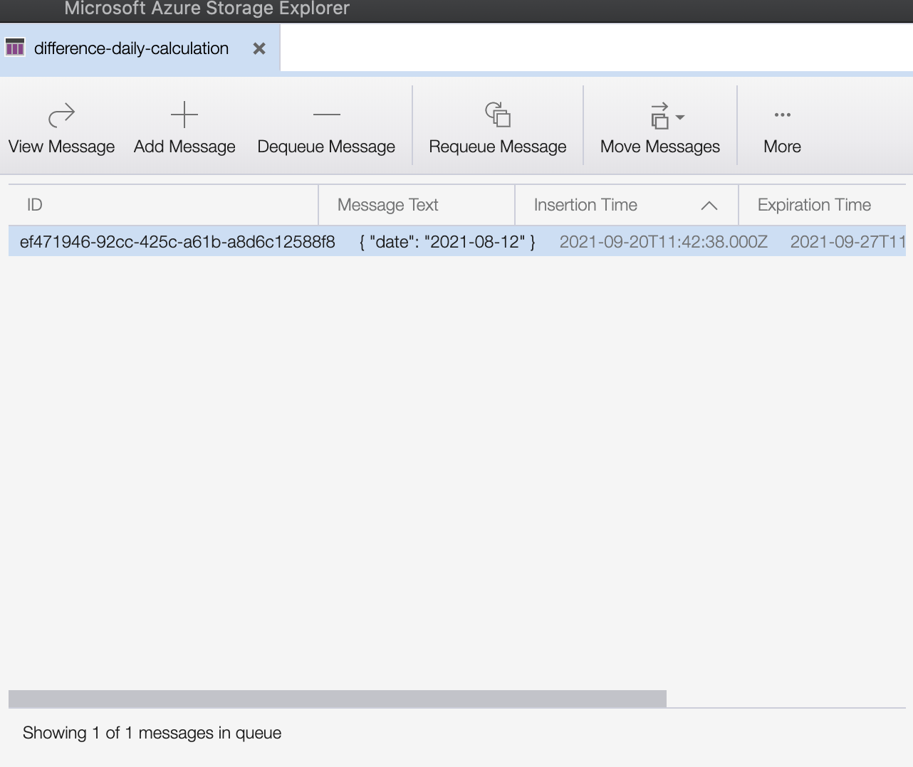

# How to create new calculation function from template

In this advanced tutorial, we will use calculationTemplate for function to calculate difference between total cases at set day and number of cases at the same day. This is not intended to calculate useful values, only to showcase the template.

Calculation functions get data from database, calculate new values and store them to database. In our case, we trigger it on new message in [Azure Storage Queue](https://docs.microsoft.com/en-us/azure/storage/queues/storage-queues-introduction). This message can be send by a loader function, which stores new values for the attributes used in calculation. This way, the data will be calculated each time new values arrive and calculated values will be up to date.

## Skills requirements

This is advanced tutorial, therefore some basic programming skills and ability to write simple functions are required.

## Prerequisites

Before you start implementing function, please follow [Start application locally for development](./start-application-locally-for-development.md) to be able to test your functionality in last steps.

## Data

Data used in this calculation is available in Sample. To load this data, follow [Run application with Sample data tutorial](./run-application-with-sample-data.md).

## Copy template

Copy `calculationTemplate` folder directly in `functions` and rename it to your wished function name. The name needs to be in camelCase with first letter in lowercase. Update the name also in `function.json` in "scriptFile" key. Rename the function in `index.ts` file, in export from this file and provide short description of your functionality.

In our case, we name our new function `differenceCalculator`.

## Set trigger

Triggers are defined in `function.json`, we have one for queue already prepared. All that needs to be done, is to set queue name. Let's call it `difference-daily-calculation`.

Our function.json looks now like this: 
```
{
  "bindings": [
    {
      "type": "queueTrigger",
      "direction": "in",
      "name": "queueMessage",
      "queueName": "difference-daily-calculation",
      "connection": "AZURE_STORAGE_CONNECTION_STRING"
    }
  ],
  "scriptFile": "../dist/differenceCalculator/index.js"
}
```

## Get data from database

Now is time for the code-writing part of tutorial. We'll start with the `./index.ts` file. This is the entry file and all parts of application are called from here.

First, we need to define which data will be fetched from database. For this purpose, there are `attributeFilters` in type `AttributeFilter`.

For each attribute, you need from database, create one item in array. The attribute is defined by attributeId in combination with date. This can be useful, when values from multiple days are required (e.g. our 7 days incidence rate).

In our case, attributeFilters look like this (dataDate is value from queue message, referring to date for which the data is uploaded):

```
const attributeFilters: Array<AttributesFilter> = 
[
  {
    attributeId: DAILY_CASES_ATTRIBUTEID,
    date: dataDate,
  },
  { attributeId: TOTAL_CASES_ATTRIBUTEID,
    date: dataDate
  },
];
```

With the attributeIds stored in constants.ts

```
export const DAILY_CASES_ATTRIBUTEID = 'Daily Covid19 Cases Per Admin1';
export const TOTAL_CASES_ATTRIBUTEID = 'Total Covid19 Cases Per Admin1';
```

The returned data are grouped by featureId and the documents from database are in 'features' array.

## Calculate

In `calculation.ts`, we will use this values to calculate new ones. Array returned from calculation function must have structure required by database schema. This structure is specified in `types.ts` and will be validated by joi validation before storing data to database.

One more step before we calculate the values. New values in database need new 'attributeId'. Constant for this value is already prepared in './constants.ts' as CALCULATED_ATTRIBUTEID. The values will be later available under this attributeId, e.g. for respective map layer or graph.

```
export const CALCULATED_ATTRIBUTEID = 'Total cases yesterday';
```

Our calculation is one difference, total cases minus daily cases. First we check, if both values are available for the featureId, only then the difference is calculated and new attribute is created. In this case, no attribute with empty value is saved.

```
import { Attribute } from './types';
import { CALCULATED_ATTRIBUTEID, DAILY_CASES_ATTRIBUTEID, TOTAL_CASES_ATTRIBUTEID } from './constants';

const calculate = (dataFromDatabase): Array<Attribute> => {
  let calculatedData = dataFromDatabase.map((feature) => {
    const { featureId } = feature._id;

    const totalCasesFeature = feature.features.find((item) => item.attributeId === TOTAL_CASES_ATTRIBUTEID);
    const dailyCases = feature.features.find((item) => item.attributeId === DAILY_CASES_ATTRIBUTEID);
    if (
      totalCasesFeature &&
      (totalCasesFeature.valueNumber || totalCasesFeature.valueNumber === 0) &&
      dailyCases &&
      (dailyCases.valueNumber || dailyCases.valueNumber === 0)
    ) {
      return {
        featureId,
        attributeId: CALCULATED_ATTRIBUTEID,
        valueNumber: totalCasesFeature.valueNumber - dailyCases.valueNumber,
        date: totalCasesFeature.date,
      };
    }
    // if the values are missing, we don't store empty attributes
    return undefined;
  });
  calculatedData = calculatedData.filter((item) => item); // remove empty items from array
  return calculatedData;
};

export default calculate;
```

## Storing to database

Since last function returns correct data format, the data storing part itself is already done and prepared.

## Preparing message queue

Before we send first message, we need to have the queue created. `initial-data-load` service already has this functionality and creates message queues defined in constant `NEW_STORAGE_QUEUES=` in .env file. Add name of the queue to the string in this constant, divided by ',' from previous values.
```
NEW_STORAGE_QUEUES=already-there-queue-name,difference-daily-calculation
```

## Test run

The function is finished. Now [(re)start the application and run initial load script](./run-application-with-sample-data.md#run-oscar-application), our function is started automatically. 

Since we defined the queue just now, no other function is sending messages there. In [Azure Storage Explorer](TODO link) we can simply create new message in the queue in following manner:

Find the query in menu, when you open it, it is empty.


Click on 'Add Message' button and create new message. Fill date from data available in database. In case you use only example data and you started the application today, please use value for yesterday or the day before.


Now, you can see the message in queue, the function will pick it in couple on second and start function. 



Just wait for it to run. The data will be available in database with attributeId as you filled in 'CALCULATED_ATTRIBUTEID' constant.

## Disclaimer

`differenceCalculator` function is created only for showcasing the template, it was not created with intent to use in production or calculate meaningful values.
