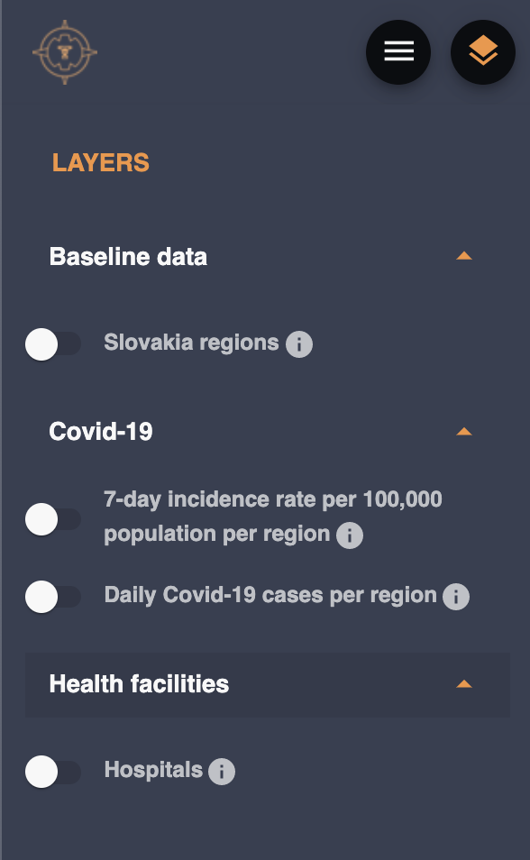

# Run Oscar application with sample data

With the source code we provide also one small set of sample data, so you will be able to start application and see some of the functionality before searching for data and going through the [Run Oscar with own data](./run-application-with-own-data.md) process.

## What kind of data and from where?

As most of the team members are from Slovakia, we choose our country as sample. For the geographical data, we transformed data from [https://www.geoportal.sk/](https://www.geoportal.sk/sk/zbgis_smd/na-stiahnutie/?fbclid=IwAR3guP09IL13Wf_zF5gVV3qkQCmIWPgRvRrUAuJ3iLh-bOLvcNnwWA9APIU) into geojson file accepted by Oscar application. This data is shared under [CC-BY 4.0](https://creativecommons.org/licenses/by/4.0/) license and are strictly for a **NON-COMMERCIAL USE ONLY**.

Second geojson file provided has list of hospitals. This one is created by us especially for functionality displaying purposes. The data is not based on reality, you won't find medical facilities there.

The data provided for dashboard graph and map layers is also made up by us and does not reflect situation in country in any time. Values are selected solely for showcasing the functionality.

## Configuration

All necessary configuration files and environment variables are set by default, you can just run the scripts as in following section.

First of them is the setup of [dashboard](../UI/dashboard-tabs.md) in /api/data/config/config.yml. In this location we provided configuration file with map coordinates to focus on Slovakia and correct zoom level to see all of the country on screen. Second part of the file tells the dashboard graphs where in the api the data can be found.

Sample data themselves are stored in /initial-data-load/data/Sample folder. Here we can find geoData.yml and geoData folder with geojson files for the geo-location part of information. One file has all the regions (admin1 level) for the country and second one stores locations of hospitals (for our purpose).

Second part of the data is mapLayers.yml, file responsible for the actual layers in menu in [map view](../UI/map.md).

Attributes folder has config file in javascript to easily add current dates in the sample data, so all the functionality of dashboard will work without further update to the data. The data itself is stored in cvs files in this folder.

## Run Oscar application

If this is your first attempt to run the application, please consult [Getting started](../getting-started/run-application.md) first. There are some necessary prerequisities.
Now you are set and ready to run the scripts. As all files are already in place, all you need is run this two scripts:

`./start.sh` will start the api frontend and database. Once you can see the frontend, you can go to next script. (Don't worry about the empty menu and dashboard, it will be filled in next step).

`./runinitialload.sh` Second script will run the initial-data-load service to fill application with data. Wait until this is finished (you will see `Successfully uploaded all initial data.`in console, where you run the script). Now return to the browser and reload the page. Now you have the application set.

## What can be seen in application

The [map view](../UI/map.md) is focused on Slovakia and in the layers menu, you can select from this layers:

Also all graphs have data, exactly as in [dashboard tabs description page](../UI/dashboard-tabs.md)
